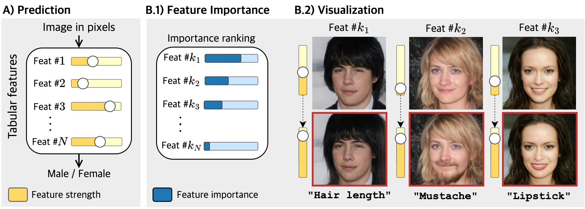
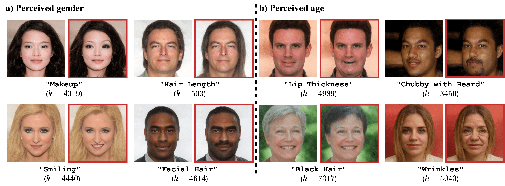
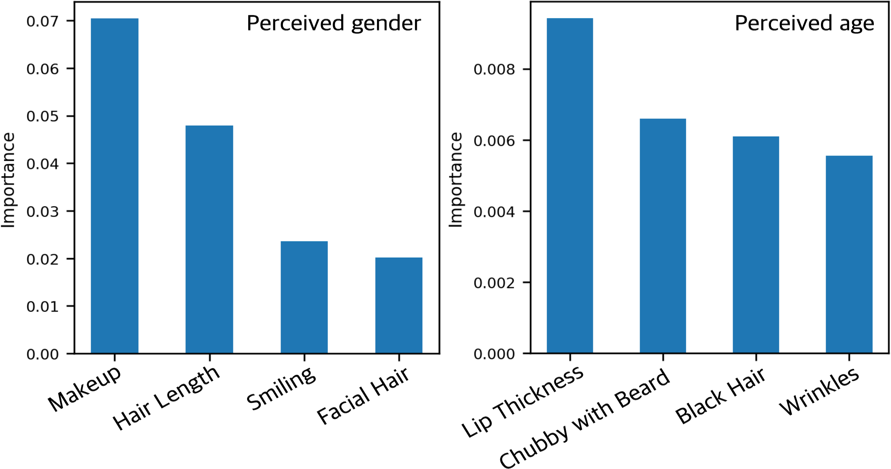

# Img2Tab: Automatic Class Relevant Concept Discovery from StyleGAN Features for Explainable Image Classification

<a href="https://arxiv.org/abs/2301.06324"></a>
<a href="https://opensource.org/licenses/MIT"></a>

>  Traditional tabular classifiers provide explainable decision-making with interpretable features(concepts). However, using their explainability in vision tasks has been limited due to the pixel representation of images. In this paper, we design Img2Tabs that classify images by concepts to harness the explainability of tabular classifiers. Img2Tabs encode image pixels into tabular features by StyleGAN inversion. Since not all of the resulting features are class-relevant or interpretable due to their generative nature, we expect Img2Tab classifiers to discover class-relevant concepts automatically from the StyleGAN features. Thus, we propose a novel method using the Wasserstein-1 metric to quantify class-relevancy and interpretability simultaneously. Using this method, we investigate whether important features extracted by tabular classifiers are class-relevant concepts. Consequently, we determine the most effective classifier for Img2Tabs in terms of discovering class-relevant concepts automatically from StyleGAN features. In evaluations, we demonstrate concept-based explanations through importance and visualization. Img2Tab achieves top-1 accuracy that is on par with CNN classifiers and deep feature learning baselines. Additionally, we show that users can easily debug Img2Tab classifiers at the concept level to ensure unbiased and fair decision-making without sacrificing accuracy.

<p align="center">

</p>
## 1. Description

Official demo implementation of "<a href="https://arxiv.org/abs/2301.06324">Img2Tab: Automatic Class Relevant Concept Discovery from StyleGAN Features for Explainable Image Classification</a>" paper. `Img2Tab_demo.ipynb` contains the following:

    - Concept-based prediction
    - Measuring concept importance
    - Visualizing important concepts
    - Presenting concepts with top-5 Wasserstein-1 metric.
    - Concept-based debugging to exclude specific unwanted concepts.


<p align="center">

</p>

<p align="center">

</p>

## 2. Prerequisites and dependencies

- Linux
- Python 3.9.7
- PyTorch 1.12.1
- NVIDIA GPU + CUDA CuDNN (CPU is available, but not computationally feasible.)
- Cuda version 11.4
- Dependency details are provided in `Img2Tab_env.yaml`

### Installation

- Clone the repository:

```
git clone https://github.com/songsnim/Img2Tab_pytorch
cd Img2Tab
```

## 2. Img2Tab pre-processed datasets
We provide pre-encoded $\Psi$ and corresponding labels as well as standardized $\Psi$. 

| Path | Description
| :--- | :----------
[Pre-encoded sets with CelebA](https://drive.google.com/drive/folders/1eXD6B2M9_6mwP8JDEgb5xOUBeEKyQYlm?usp=share_link)| This links provide pre-encoded $\Psi$ sets by Img2Tab encoder.|

Download all files from the link into `datasets` folder.
## 3. Img2Tab modules
Download pre-trained Img2Tab modules below.

| Path | Description
| :--- | :----------
|[FFHQ Inversion](https://drive.google.com/file/d/1cUv_reLE6k3604or78EranS7XzuVMWeO/view?usp=sharing) | FFHQ e4e encoder. This is main Img2Tab inversion networks |
|[FFHQ StyleGAN](https://drive.google.com/file/d/1EM87UquaoQmk17Q8d5kYIAHqu0dkYqdT/view?usp=sharing) | Pre-trained StyleGAN models on FFHQ from [rosinality](https://github.com/rosinality/stylegan2-pytorch).
|[IR-SE50 Model](https://drive.google.com/file/d/1KW7bjndL3QG3sxBbZxreGHigcCCpsDgn/view?usp=sharing) | Pre-trained IR-SE50 model from [TreB1eN](https://github.com/TreB1eN/InsightFace_Pytorch) for use in ID loss during training e4e.
|[MOCOv2 Model](https://drive.google.com/file/d/18rLcNGdteX5LwT7sv_F7HWr12HpVEzVe/view?usp=sharing) | Pre-trained ResNet-50 model trained using MOCOv2 for use in e4e simmilarity loss for domains other then human faces during training e4e.
|[Face landmark](http://dlib.net/files/shape_predictor_68_face_landmarks.dat.bz2) | Pre-trained dlib face landmark detector for use in CelebA face recognition. This file is in zip format and should be extracted to `pretrained_models` folder.| 

All these files are supposed to be downloaded in `pretrained_models` folder.

## 4. Run Img2Tab demo
Follow instruction in `Img2Tab_demo.ipynb` to try Img2Tab demo.

## Acknowledgments
This code borrows heavily from [encoder4editing](https://github.com/omertov/encoder4editing)

## Citation
Please cite our paper via this link: <a href="https://arxiv.org/abs/2301.06324">Img2Tab: Automatic Class Relevant Concept Discovery from StyleGAN Features for Explainable Image Classification</a>
